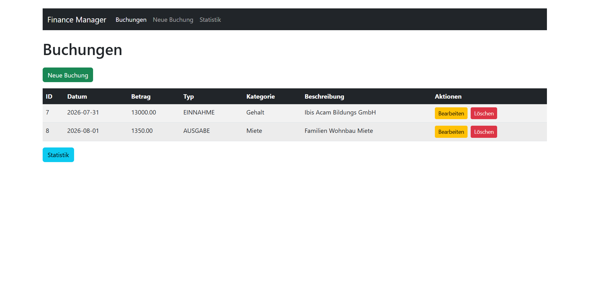
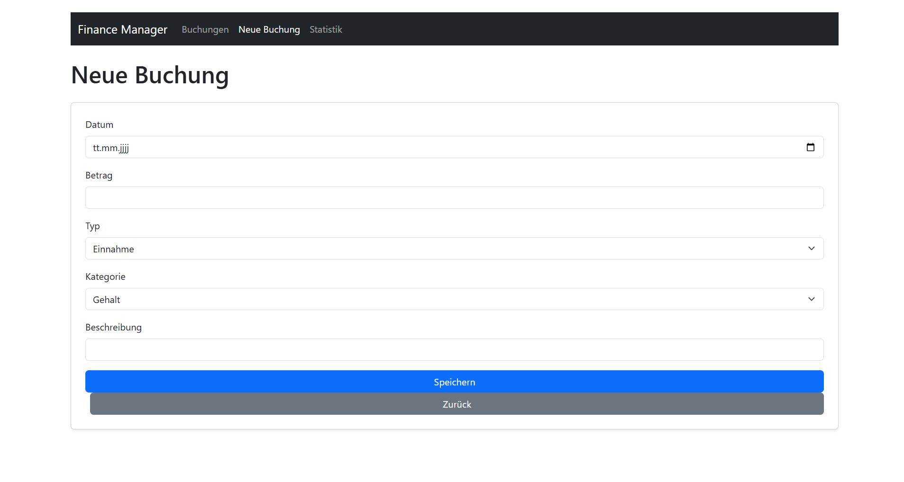
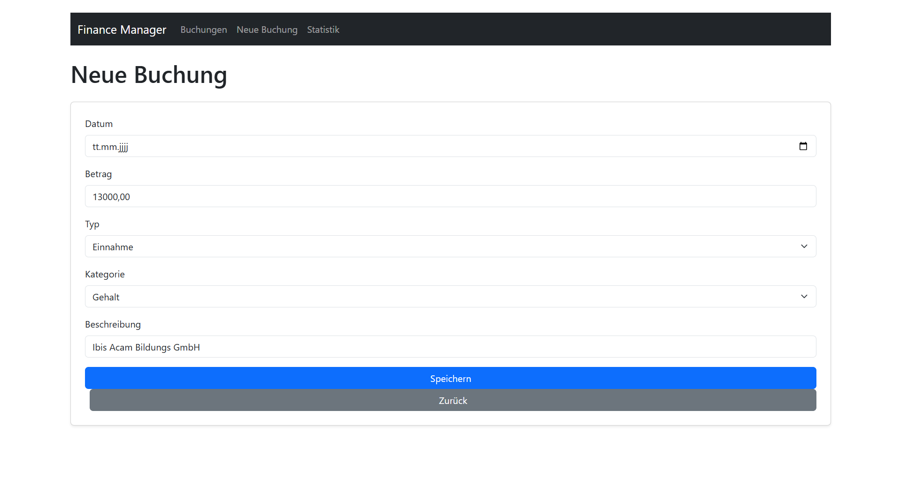
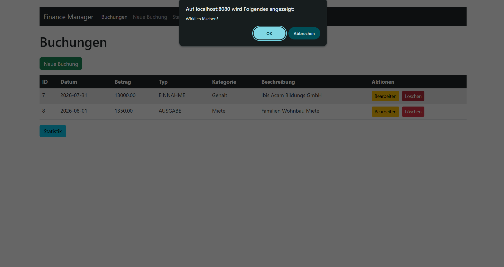
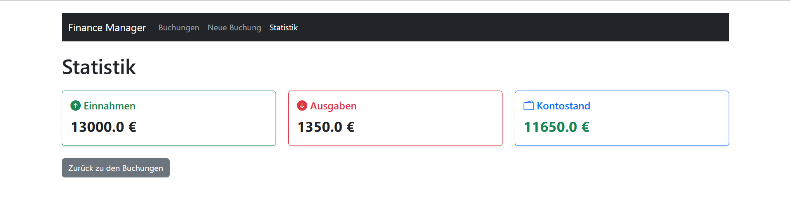
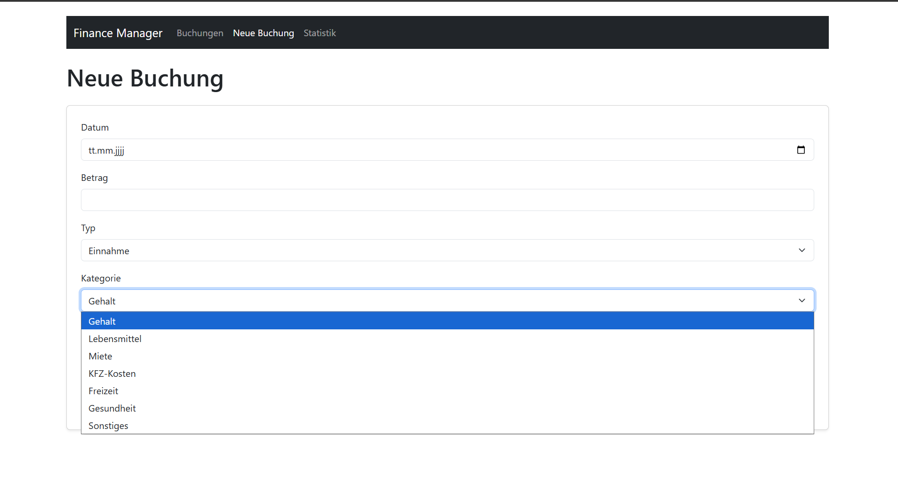

# Kassenbuch / Finance Manager

## Technologien

- Backend
    - **Java 17** 
    - **Spring Boot 3**
    - **Spring MVC**
    - **Spring Data JPA**
    - **Maven**

- DB
  - **PostgreSQL 16**
  - **Docker / Docker Compose**

- Frontend
    - **Thymeleaf**
    - **Bootstrap 5**


## Features

### Buchungen Verwalten
- Neue buchungen erfassen(Datum, Betrag, Typ, Katigorie, Beschreibung(Optional))



- Buchungen **bearbeiten** 



- Buchungen **löschen**



- Farben für Einnahmen (Grün) und Ausgaben (Rot)



- Vordefinierte Katigorien:
  - Gehalt
  - Miete
  - Lebensmittel
  - KFZ-Kosten
  - Freizeit
  - Gesundheit
  - Sonstiges



###  Statistik‑Dashboard
- Einnahmen‑Summe
- Ausgaben‑Summe
- Kontostand

v


### Navigation
- Moderne Bootstrap‑Navbar
- Aktiver Menüpunkt wird automatisch hervorgehoben
- Links zu:
    - Buchungen
    - Neue Buchung
    - Statistik


### Responsive Design
- Vollständig responsive dank Bootstrap 5
- Mobile‑freundliche Navigation
- Tabellen skalieren automatisch
- Dashboard passt sich an alle Bildschirmgrößen an

## PostgreSQL mit Docker starten

1. PostgreSQL-Container starten:

```powershell
docker compose up -d
```

2. Spring Boot App starten (nutzt dann PostgreSQL auf `localhost:5433`):

```powershell
.\mvnw.cmd spring-boot:run
```

3. Container stoppen:

```powershell
docker compose down
```

### Verwendete DB-Konfiguration

- URL: `jdbc:postgresql://localhost:5433/finance_db`
- User: `finance_user`
- Passwort: `finance_password`

Hinweis: Das Init-Skript liegt unter `docker/init/01-init.sql` und wird nur beim ersten Start mit leerem Docker-Volume ausgeführt.
Wenn `5433` bereits belegt ist, passe den linken Port im Mapping in `docker-compose.yml` an und aktualisiere die JDBC-URL entsprechend.
